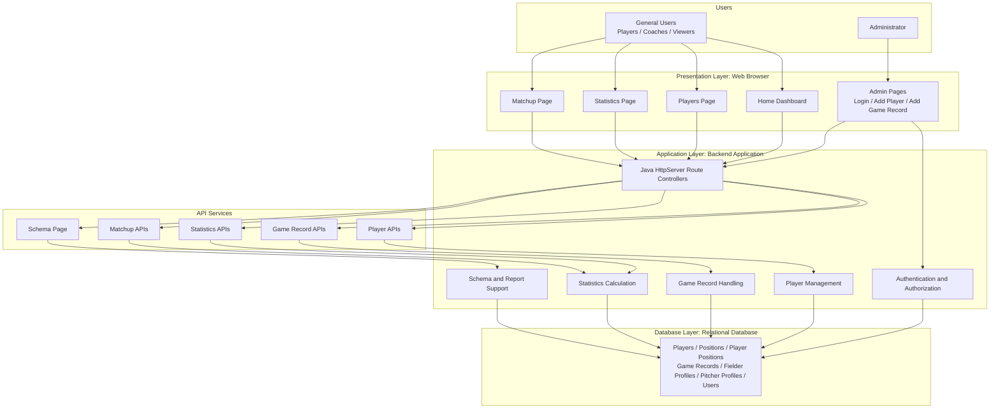
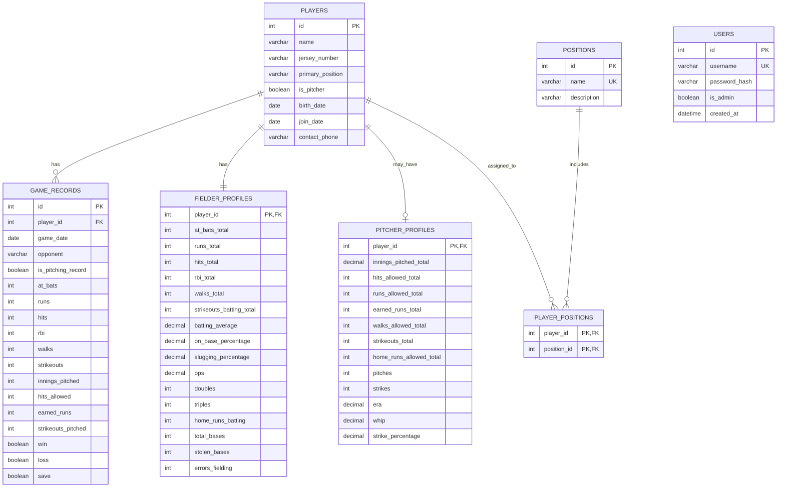

# Phase 2 Diagrams

These Mermaid diagrams can be copied into the Phase 2 report and exported as images if required.

Exportable SVG versions are also provided:

- `docs/assets/system_architecture.svg`
- `docs/assets/er_diagram.svg`

## Formal System Architecture Diagram

## ER Diagram

## Diagram Notes

- The architecture diagram is a formal block diagram that separates users, web pages, backend application logic, API services, and the relational database.
- The ER diagram replaces the unclear handwritten Phase 1 diagram with readable entities, attributes, keys, and cardinalities.
- `PLAYER_POSITIONS` resolves the many-to-many relationship between `PLAYERS` and `POSITIONS`.
- `FIELDER_PROFILES` and `PITCHER_PROFILES` are now justified by their detailed aggregate statistics.
- `GAME_RECORDS` is the transaction table used to store per-player performance in each game.
